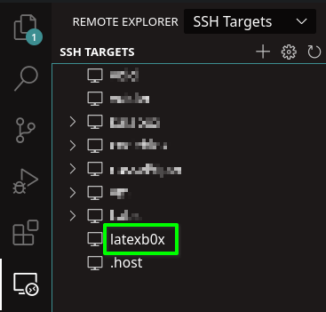
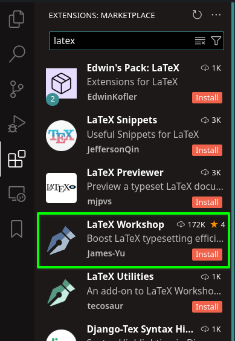
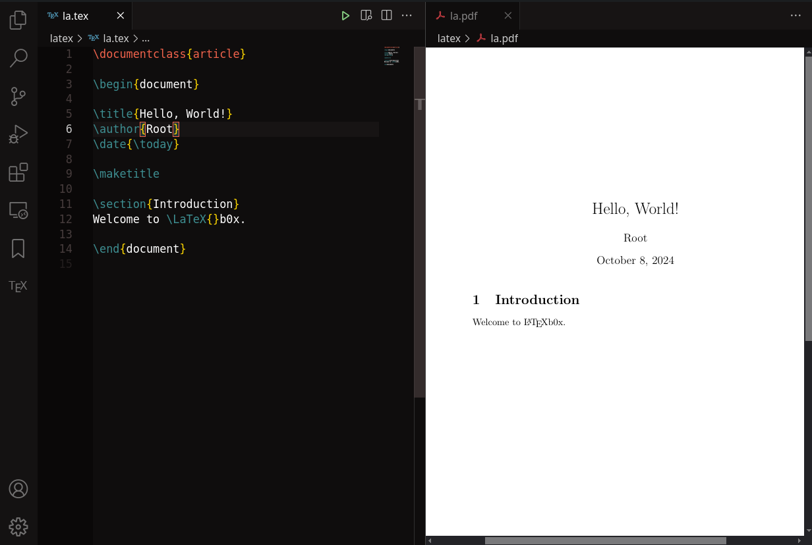

# LaTeXb0x
A local solution for using latex using containerization.

# Generate SSH keys
```bash
ssh-keygen -t ed25519 -f latex_id_ed25519 -C "optional comment here"
```

# Build 
For building the image locally :
```bash
docker build -t latexb0x:$(date +'%Y.%m.%d') .
```

# SSH setup
In your ssh config file, paste :

```bash
Host latexb0x
  Hostname localhost
  User root
  Port 9001
  IdentityFile <path>/latex_id_ed25519
```

# How to use:
* Generate the ssh key and copy it to appropriate path
* At first get the image and make a container following [compose](compose.yaml) file or any other method.
* Update `$HOME/.ssh/config` with appropriate ssh config
* Install and use `Open Remote - SSH` VSCode plugin to ssh into latexb0x. This step **might need some time** to download the necessery files.



* Install `LaTeX Workspace` plugin for VSCode



* Try generating a hello world texfile

```tex
\documentclass{article}

\begin{document}

\title{Hello, World!}
\author{Root}
\date{\today}

\maketitle

\section{Introduction}
Welcome to \LaTeX{}b0x.

\end{document}
```



* ENJOY !


